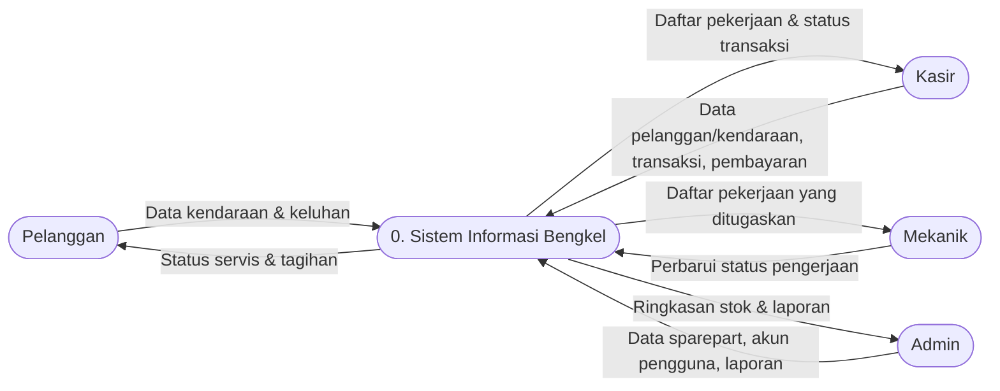
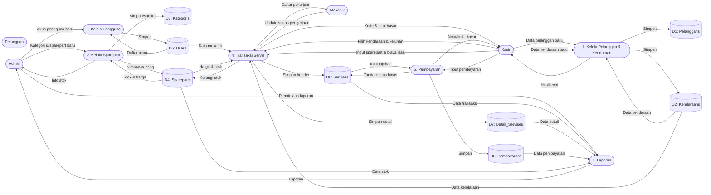
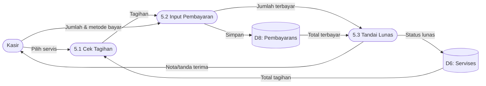
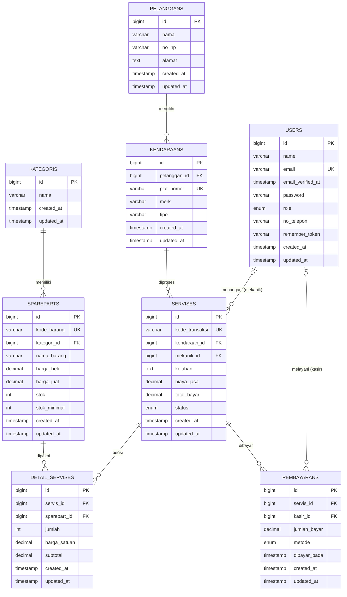

# Sistem Informasi Bengkel (Rancangan Ulang)

> **Status dokumen:** Rancangan/desain sistem **versi baru** — *implementasi kode sudah mengikuti desain ini.*
> Dokumen berisi analisis kebutuhan, DFD, normalisasi, ERD, dan tabel normalisasi sebagai acuan implementasi aplikasi.

## Daftar Isi

1. [Analisis Sistem](#1-analisis-sistem)
2. [Data Flow Diagram (DFD)](#2-data-flow-diagram-dfd)
3. [Normalisasi](#3-normalisasi)
4. [Entity Relationship Diagram (ERD)](#4-entity-relationship-diagram-erd)
5. [Tabel Normalisasi (Rancangan Final)](#5-tabel-normalisasi-rancangan-final)
6. [Ringkasan Relasi](#6-ringkasan-relasi)
7. [Catatan Implementasi](#7-catatan-implementasi)

---

## 1. Analisis Sistem

### 1.1 Gambaran Umum

Sistem Informasi Bengkel adalah aplikasi web untuk mengelola operasional bengkel kendaraan, meliputi:
pendataan **pelanggan & kendaraan**, inventaris **sparepart (suku cadang)**, pencatatan **transaksi servis**,
**pembayaran**, serta **laporan**. Aplikasi dipakai oleh tiga peran staf: *Admin, Kasir, dan Mekanik*.

### 1.2 Aktor dan Hak Akses

| No | Aktor | Peran | Hak Akses |
|----|-------|-------|-----------|
| 1 | **Admin** | Pemilik/pimpinan bengkel | Kelola akun pengguna, kelola sparepart & kategori, kelola pelanggan/kendaraan, melihat semua transaksi & laporan |
| 2 | **Kasir** | Petugas front-office | Kelola pelanggan & kendaraan, mencatat transaksi servis, mencatat pembayaran, melihat riwayat transaksi |
| 3 | **Mekanik** | Teknisi bengkel | Melihat daftar pekerjaan yang ditugaskan kepadanya, memperbarui status pengerjaan hingga selesai |
| 4 | **Pelanggan** | Konsumen (bukan akun login) | Memperoleh informasi status servis & tagihan dari staf |

### 1.3 Kebutuhan Fungsional

| Kode | Kebutuhan Fungsional | Aktor |
|------|----------------------|-------|
| FR-01 | Sistem dapat mengelola data pengguna (tambah kasir/mekanik/admin, ubah, nonaktifkan) | Admin |
| FR-02 | Sistem dapat mengelola data pelanggan (nama, No. HP, alamat) | Admin, Kasir |
| FR-03 | Sistem dapat mengelola data kendaraan (plat, merk, tipe) milik satu pelanggan | Admin, Kasir |
| FR-04 | Sistem dapat mengelola kategori sparepart | Admin |
| FR-05 | Sistem dapat mengelola data sparepart beserta harga beli, harga jual, dan stok | Admin |
| FR-06 | Sistem dapat mencatat transaksi servis (kendaraan, keluhan, mekanik, spontan sparepart, biaya jasa) | Admin, Kasir |
| FR-07 | Sistem dapat menghitung total bayar = biaya jasa + subtotal sparepart secara otomatis | Sistem |
| FR-08 | Sistem dapat mengurangi stok sparepart otomatis saat sparepart dipakai | Sistem |
| FR-09 | Sistem dapat memperbarui status pengerjaan servis (antre, proses, selesai) | Mekanik |
| FR-10 | Sistem dapat mencatat pembayaran dan menandai servis lunas | Admin, Kasir |
| FR-11 | Sistem dapat menampilkan laporan (pendapatan, stok sparepart, transaksi) | Admin |

### 1.4 Kebutuhan Non-Fungsional

| Kode | Kebutuhan Non-Fungsional |
|------|--------------------------|
| NFR-01 | Keamanan: autentikasi & otorisasi per peran, input divalidasi |
| NFR-02 | Keandalan: proses transaksi servis menggunakan transaksi basis data (atomicity) |
| NFR-03 | Audit: pencatatan siapa mekanik & siapa kasir yang melayani |
| NFR-04 | Tampilan responsif (web), mudah dipahami oleh staf non-teknis |

---

## 2. Data Flow Diagram (DFD)

### 2.1 DFD Level 0 — Diagram Konteks



### 2.2 DFD Level 1



### 2.3 DFD Level 2 — Proses Transaksi Servis (4)


### 2.4 DFD Level 2 — Proses Pembayaran (5)



---

## 3. Normalisasi

> **Ringkasan cepat (sat-set):** alur "pecahnya tabel" dari data mentah sampai hasil akhir.

| Tahap | Jumlah Tabel | Tabel yang terbentuk |
|-------|--------------|----------------------|
| 0NF (RAW) | 1 | satu relasi berisi semua kolom (pemilik, kendaraan, sparepart, jasa, status) |
| 1NF | 1 | seluruh kolom atomik — satu nilai, tanpa kelompok berulang |
| 2NF | 3 | **spareparts**, **servises**, **detail_servises** |
| 3NF | 8 | **pelanggans**, **kendaraans**, **kategoris**, **users**, **pembayarans**, **spareparts**, **servises**, **detail_servises** |

> Proses berikut dikerjakan **tanpa contoh data** — murni menurunkan satu tabel berkolom banyak memakai aturan
> ketergantungan fungsional (FD). Penjelasan detail setiap tahap ada di 3.1–3.5.

---

### 3.1 Satu Tabel Awal (UNF)

Normalisasi dimulai dari **satu relasi** (R) yang berisi semua atribut (kolom) yang dibutuhkan aplikasi, digabung
menjadi satu tabel:

```
R( Kode_Servis, Tanggal, Kode_Barang, Kategori, Nama_Barang, Harga_Jual,
   Jumlah, Subtotal, Plat_Nomor, Merk, Tipe, Nama_Pemilik, No_HP, Alamat,
   Nama_Mekanik, Biaya_Jasa, Status_Pembayaran )
```

> Seluruh atribut sudah **atomik** (satu nilai, tidak ada kelompok berulang), sehingga secara definisi R sudah
> memenuhi **1NF**. Anomali yang tersisa justru berada di tingkat 2NF dan 3NF. Proses menurun berikut **tidak
> membutuhkan data contoh** — murni berbasis ketergantungan fungsional.

### 3.2 Ketergantungan Fungsional (FD) dan Kunci Kandidat

Ketergantungan fungsional adalah aturan: *"jika nilai atribut X diketahui, nilai atribut Y menjadi pasti"*.
FD di bawah ini didefinisikan dari aturan bisnis, bukan dari melihat baris data:

| No | Ketergantungan Fungsional | Maksud |
|----|---------------------------|--------|
| FD-1 | `{Kode_Barang}` → `Kategori, Nama_Barang, Harga_Jual` | 1 barang punya 1 kategori, 1 nama, 1 harga |
| FD-2 | `{Kode_Servis}` → `Tanggal, Nama_Pemilik, No_HP, Alamat, Plat_Nomor, Merk, Tipe, Nama_Mekanik, Biaya_Jasa, Status_Pembayaran` | 1 servis menentukan tanggal, kendaraan, pemilik, mekanik, jasa, dan status |
| FD-3 | `{(Kode_Servis, Kode_Barang)}` → `Jumlah, Subtotal` | kombinasi servis+barang menentukan jumlah & subtotal |
| FD-4 | `{Plat_Nomor}` → `Merk, Tipe, Nama_Pemilik, No_HP, Alamat` | 1 kendaraan ditandai 1 plat dan dipunyai 1 pemilik |
| FD-5 | `{Nama_Mekanik}` → identitas mekanik | mekanik adalah orang (entitas tersendiri) |
| FD-6 | `{Kategori}` → identitas kategori | kategori sparepart adalah entitas tersendiri |

**Kunci kandidat** R: `(Kode_Servis, Kode_Barang)` — kombinasi ini yang dapat menentukan seluruh atribut lain
melalui FD-1, FD-2, dan FD-3.

### 3.3 Bentuk Normal Kedua (2NF)

2NF menghilangkan **ketergantungan parsial**: atribut yang bergantung hanya pada *sebagian* kunci (bukan kunci
penuh) dipisah ke relasi sendiri. Dari FD-1 dan FD-2 terlihat anomali parsial, sehingga R dipecah menjadi **3
relasi**:

```
Spareparts(      Kode_Barang [PK], Kategori, Nama_Barang, Harga_Jual )        ← dari FD-1
Servises(        Kode_Servis [PK], Tanggal, Nama_Pemilik, No_HP, Alamat,      ← dari FD-2
                 Plat_Nomor, Merk, Tipe, Nama_Mekanik, Biaya_Jasa, Status_Pembayaran )
Detail_Servises( Kode_Servis [FK], Kode_Barang [FK], Jumlah, Subtotal )       ← dari FD-3 (kunci penuh)
```

Kunci gabungan `(Kode_Servis, Kode_Barang)` kini hanya tersisa di `Detail_Servises`.

### 3.4 Bentuk Normal Ketiga (3NF)

3NF menghilangkan **ketergantungan transitif**: atribut bukan-kunci yang bergantung pada atribut bukan-kunci lain
dipisah menjadi entitas mandiri. Melalui FD-4 sampai FD-6, anomali transitif dipecah sehingga diperoleh **8
relasi**:

```
Users(           User_ID [PK], Nama, Role )
Kategoris(       Kategori_ID [PK], Nama )
Pelanggans(      Pelanggan_ID [PK], Nama, No_HP, Alamat )
Kendaraans(      Kendaraan_ID [PK], Pelanggan_ID [FK], Plat_Nomor, Merk, Tipe )
Spareparts(      Kode_Barang [PK], Kategori_ID [FK], Nama_Barang, Harga_Jual )
Servises(        Kode_Servis [PK], Kendaraan_ID [FK], Mekanik_ID [FK], Tanggal,
                 Biaya_Jasa, Status_Pengerjaan )
Detail_Servises( Kode_Servis [FK], Kode_Barang [FK], Jumlah, Subtotal )
Pembayarans(     Pembayaran_ID [PK], Kode_Servis [FK], Jumlah_Bayar, Metode, Dibayar_Pada )
```

Keputusan saat 3NF:
- `Nama_Pemilik`, `No_HP`, `Alamat` ikut `Plat_Nomor` (FD-4) → **Pelanggans**; kendaraan menunjuk pelanggan via ID.
- `Nama_Mekanik` → **Users** (dirujuk sebagai `Mekanik_ID`).
- `Kategori` → **Kategoris** (dirujuk sebagai `Kategori_ID`).
- `Status_Pembayaran` (Lunas/Belum) → **Pembayarans**, karena satu servis dapat dibayar beberapa kali.

### 3.5 Hasil Akhir

Desain **memenuhi 3NF** dan menghasilkan **8 entitas akhir**:
`users`, `kategoris`, `spareparts`, `pelanggans`, `kendaraans`, `servises`, `detail_servises`, `pembayarans`.
Lihat relasi antar-entitas pada [ERD (bab 4)](#4-entity-relationship-diagram-erd) dan definisi kolom lengkap
pada [Tabel Normalisasi (bab 5)](#5-tabel-normalisasi-rancangan-final).

---

## 4. Entity Relationship Diagram (ERD)



---

## 5. Tabel Normalisasi (Rancangan Final)

### 5.1 users

| Kolom | Tipe | Kunci | Keterangan |
|-------|------|-------|------------|
| id | BIGINT | PK | Nomor unik pengguna |
| name | VARCHAR | | Nama lengkap |
| email | VARCHAR | UK | Email login (unik) |
| email_verified_at | TIMESTAMP | | Waktu verifikasi email |
| password | VARCHAR | | Hash kata sandi |
| role | ENUM | | `admin`, `kasir`, `mekanik` |
| no_telepon | VARCHAR | | Nomor telepon pengguna |
| remember_token | VARCHAR | | Token "ingat saya" |
| created_at / updated_at | TIMESTAMP | | Waktu rekam/ubah |

### 5.2 kategoris

| Kolom | Tipe | Kunci | Keterangan |
|-------|------|-------|------------|
| id | BIGINT | PK | Nomor unik kategori |
| nama | VARCHAR | | Nama kategori sparepart (mis. Oli, Ban, Busi) |
| created_at / updated_at | TIMESTAMP | | Waktu rekam/ubah |

### 5.3 spareparts

| Kolom | Tipe | Kunci | Keterangan |
|-------|------|-------|------------|
| id | BIGINT | PK | Nomor unik sparepart |
| kode_barang | VARCHAR | UK | Kode barang (unik) |
| kategori_id | BIGINT | FK → kategoris | Kategori sparepart |
| nama_barang | VARCHAR | | Nama barang |
| harga_beli | DECIMAL(12,2) | | Harga modal (untuk laba/laporan) |
| harga_jual | DECIMAL(12,2) | | Harga jual |
| stok | INT | | Jumlah stok |
| stok_minimal | INT | | Batas stok minim (untuk peringatan) |
| created_at / updated_at | TIMESTAMP | | Waktu rekam/ubah |

### 5.4 pelanggans

| Kolom | Tipe | Kunci | Keterangan |
|-------|------|-------|------------|
| id | BIGINT | PK | Nomor unik pelanggan |
| nama | VARCHAR | | Nama pemilik/pelanggan |
| no_hp | VARCHAR | | Nomor telepon |
| alamat | TEXT | | Alamat |
| created_at / updated_at | TIMESTAMP | | Waktu rekam/ubah |

### 5.5 kendaraans

| Kolom | Tipe | Kunci | Keterangan |
|-------|------|-------|------------|
| id | BIGINT | PK | Nomor unik kendaraan |
| pelanggan_id | BIGINT | FK → pelanggans | Pemilik kendaraan (1 pelanggan → banyak kendaraan) |
| plat_nomor | VARCHAR | UK | Nomor plat (unik) |
| merk | VARCHAR | | Merek (Honda, Yamaha, Toyota) |
| tipe | VARCHAR | | Tipe (Vario 150, NMAX, Avanza) |
| created_at / updated_at | TIMESTAMP | | Waktu rekam/ubah |

### 5.6 servises

| Kolom | Tipe | Kunci | Keterangan |
|-------|------|-------|------------|
| id | BIGINT | PK | Nomor unik transaksi |
| kode_transaksi | VARCHAR | UK | Nomor transaksi (mis. SRV-20260919-XXXX) |
| kendaraan_id | BIGINT | FK → kendaraans | Kendaraan yang diservis |
| mekanik_id | BIGINT | FK → users (nullable) | Mekanik penanggung jawab |
| keluhan | TEXT | | Keluhan/jenis servis |
| biaya_jasa | DECIMAL(12,2) | | Biaya jasa servis |
| total_bayar | DECIMAL(12,2) | | Total tagihan (jasa + sparepart) |
| status | ENUM | | `antre`, `proses`, `selesai`, `batal` |
| created_at / updated_at | TIMESTAMP | | Waktu rekam/ubah |

### 5.7 detail_servises

| Kolom | Tipe | Kunci | Keterangan |
|-------|------|-------|------------|
| id | BIGINT | PK | Nomor unik detail |
| servis_id | BIGINT | FK → servises | Transaksi servis induk |
| sparepart_id | BIGINT | FK → spareparts | Sparepart terpakai |
| jumlah | INT | | Jumlah dipakai |
| harga_satuan | DECIMAL(12,2) | | Harga satuan saat transaksi |
| subtotal | DECIMAL(12,2) | | Jumlah × harga satuan |
| created_at / updated_at | TIMESTAMP | | Waktu rekam/ubah |

### 5.8 pembayarans

| Kolom | Tipe | Kunci | Keterangan |
|-------|------|-------|------------|
| id | BIGINT | PK | Nomor unik pembayaran |
| servis_id | BIGINT | FK → servises | Transaksi yang dibayar |
| kasir_id | BIGINT | FK → users | Kasir yang melayani pembayaran |
| jumlah_bayar | DECIMAL(12,2) | | Jumlah dibayarkan |
| metode | ENUM | | `tunai`, `transfer`, `qris` |
| dibayar_pada | TIMESTAMP | | Waktu pembayaran |
| created_at / updated_at | TIMESTAMP | | Waktu rekam/ubah |

---

## 6. Ringkasan Relasi

| Induk | Relasi | Anak | Tipe |
|-------|--------|------|------|
| kategoris | 1 — N | spareparts | satu kategori memiliki banyak sparepart |
| pelanggans | 1 — N | kendaraans | satu pelanggan memiliki banyak kendaraan |
| kendaraans | 1 — N | servises | satu kendaraan memiliki banyak riwayat servis |
| users (mekanik) | 1 — N | servises | satu mekanik menangani banyak servis |
| servises | 1 — N | detail_servises | satu servis berisi banyak penggunaan sparepart |
| spareparts | 1 — N | detail_servises | satu sparepart dapat dipakai di banyak servis |
| servises | 1 — N | pembayarans | satu servis dapat memiliki banyak pembayaran |
| users (kasir) | 1 — N | pembayarans | satu kasir melayani banyak pembayaran |

---

## 7. Catatan Implementasi

Desain di atas telah **diimplementasikan pada kode** (migrasi, model, controller, view, dan test). Berikut perubahan dari implementasi lama ke baru:

| Aspek | Sebelum | Sesudah (Kini) |
|-------|---------|----------------|
| Data pemilik kendaraan | menyatu di `kendaraans` (`nama_pemilik`, `no_hp`) | tabel terpisah **pelanggans** |
| Merek & tipe | satu kolom `merk_tipe` | dipisah **merk** & **tipe** |
| Kategori sparepart | tidak ada | tabel **kategoris** |
| Harga beli / stok minimal | tidak ada | ditambahkan ke **spareparts** |
| Riwayat pembayaran | hanya status `lunas` | tabel **pembayarans** (metode, kasir, tanggal) |
| Status servis | `antre, proses, selesai, lunas` | `antre, proses, selesai, batal` + status pelunasan dari pembayarans |
| Nomor telepon pengguna | tidak ada | ditambahkan kolom `no_telepon` di **users** |