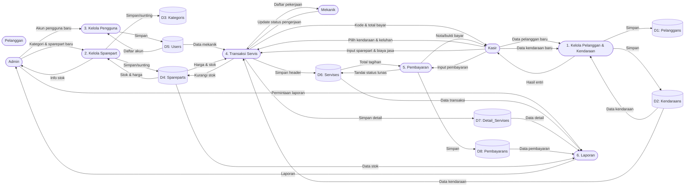
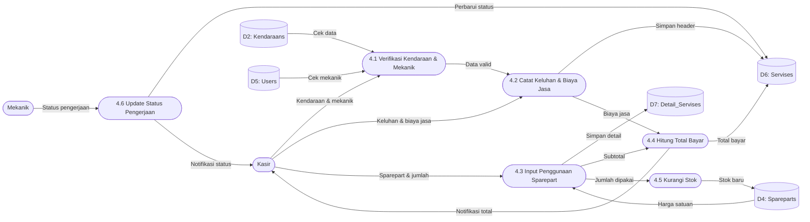
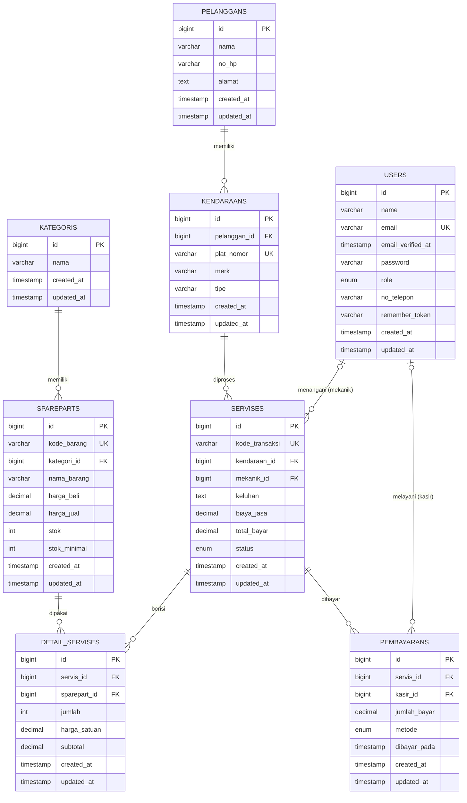

# Sistem Informasi Bengkel (Rancangan Ulang)

> **Status dokumen:** Rancangan/desain sistem **versi baru** — *implementasi kode menyusul.*
> Dokumen ini berisi analisis kebutuhan, DFD, normalisasi, ERD, dan tabel normalisasi sebagai acuan pembangunan ulang aplikasi.

## Daftar Isi

1. [Analisis Sistem](#1-analisis-sistem)
2. [Data Flow Diagram (DFD)](#2-data-flow-diagram-dfd)
3. [Normalisasi](#3-normalisasi)
4. [Entity Relationship Diagram (ERD)](#4-entity-relationship-diagram-erd)
5. [Tabel Normalisasi (Rancangan Final)](#5-tabel-normalisasi-rancangan-final)
6. [Ringkasan Relasi](#6-ringkasan-relasi)
7. [Catatan Implementasi](#7-catatan-implementasi)

---

## 1. Analisis Sistem

### 1.1 Gambaran Umum

Sistem Informasi Bengkel adalah aplikasi web untuk mengelola operasional bengkel kendaraan, meliputi:
pendataan **pelanggan & kendaraan**, inventaris **sparepart (suku cadang)**, pencatatan **transaksi servis**,
**pembayaran**, serta **laporan**. Aplikasi dipakai oleh tiga peran staf: *Admin, Kasir, dan Mekanik*.

### 1.2 Aktor dan Hak Akses

| No | Aktor | Peran | Hak Akses |
|----|-------|-------|-----------|
| 1 | **Admin** | Pemilik/pimpinan bengkel | Kelola akun pengguna, kelola sparepart & kategori, kelola pelanggan/kendaraan, melihat semua transaksi & laporan |
| 2 | **Kasir** | Petugas front-office | Kelola pelanggan & kendaraan, mencatat transaksi servis, mencatat pembayaran, melihat riwayat transaksi |
| 3 | **Mekanik** | Teknisi bengkel | Melihat daftar pekerjaan yang ditugaskan kepadanya, memperbarui status pengerjaan hingga selesai |
| 4 | **Pelanggan** | Konsumen (bukan akun login) | Memperoleh informasi status servis & tagihan dari staf |

### 1.3 Kebutuhan Fungsional

| Kode | Kebutuhan Fungsional | Aktor |
|------|----------------------|-------|
| FR-01 | Sistem dapat mengelola data pengguna (tambah kasir/mekanik/admin, ubah, nonaktifkan) | Admin |
| FR-02 | Sistem dapat mengelola data pelanggan (nama, No. HP, alamat) | Admin, Kasir |
| FR-03 | Sistem dapat mengelola data kendaraan (plat, merk, tipe) milik satu pelanggan | Admin, Kasir |
| FR-04 | Sistem dapat mengelola kategori sparepart | Admin |
| FR-05 | Sistem dapat mengelola data sparepart beserta harga beli, harga jual, dan stok | Admin |
| FR-06 | Sistem dapat mencatat transaksi servis (kendaraan, keluhan, mekanik, spontan sparepart, biaya jasa) | Admin, Kasir |
| FR-07 | Sistem dapat menghitung total bayar = biaya jasa + subtotal sparepart secara otomatis | Sistem |
| FR-08 | Sistem dapat mengurangi stok sparepart otomatis saat sparepart dipakai | Sistem |
| FR-09 | Sistem dapat memperbarui status pengerjaan servis (antre, proses, selesai) | Mekanik |
| FR-10 | Sistem dapat mencatat pembayaran dan menandai servis lunas | Admin, Kasir |
| FR-11 | Sistem dapat menampilkan laporan (pendapatan, stok sparepart, transaksi) | Admin |

### 1.4 Kebutuhan Non-Fungsional

| Kode | Kebutuhan Non-Fungsional |
|------|--------------------------|
| NFR-01 | Keamanan: autentikasi & otorisasi per peran, input divalidasi |
| NFR-02 | Keandalan: proses transaksi servis menggunakan transaksi basis data (atomicity) |
| NFR-03 | Audit: pencatatan siapa mekanik & siapa kasir yang melayani |
| NFR-04 | Tampilan responsif (web), mudah dipahami oleh staf non-teknis |

---

## 2. Data Flow Diagram (DFD)

### 2.1 DFD Level 0 — Diagram Konteks


### 2.2 DFD Level 1



### 2.3 DFD Level 2 — Proses Transaksi Servis (4)



### 2.4 DFD Level 2 — Proses Pembayaran (5)


---

## 3. Normalisasi

### 3.1 Bentuk Tidak Normal (UNF)

Data mentah hasil pencatatan manual bengkel. Terdapat **kelompok berulang** (beberapa sparepart dalam satu
transaksi servis) dan data pemilik/kendaraan ditulis berulang setiap kali servis:

| No | Kode Servis | Tanggal | Pemilik | No HP | Alamat | Plat Nomor | Merk | Tipe | Keluhan | Mekanik | Sparepart Terpakai | Biaya Jasa | Total | Status |
|----|-------------|---------|---------|-------|--------|------------|------|------|---------|---------|--------------------|------------|-------|--------|
| 1 | SRV-001 | 19-09-2026 | Andi Wijaya | 081234567890 | Jl. Merdeka No.1 | B 1234 ABC | Honda | Vario 150 | Ganti oli & servis rutin | Budi | OLI-001, BUSI-001 | 50.000 | 185.000 | Lunas |
| 2 | SRV-002 | 20-09-2026 | Andi Wijaya | 081234567890 | Jl. Merdeka No.1 | B 1234 ABC | Honda | Vario 150 | Cek rem | Rudi | BUSI-001 | 35.000 | 60.000 | Lunas |

Contoh rekaman manual (lebih detail):

```
SRV-001 | 19-09-2026
  Pemilik     : Andi Wijaya | 081234567890 | Jl. Merdeka No.1
  Kendaraan   : B 1234 ABC | Honda | Vario 150
  Keluhan     : Ganti oli & servis rutin
  Mekanik     : Budi
  Sparepart   : [OLI-001  Oli MPX2   55.000 x2 = 110.000]
                [BUSI-001 Busi NGK   25.000 x1 =  25.000]
  Biaya Jasa  : 50.000     Total : 185.000     Status : Lunas
```

### 3.2 Bentuk Normal Pertama (1NF)

Menghilangkan **kelompok berulang** → setiap kolom berisi data **atomik** (tidak ada kumpulan sparepart dalam satu
sel) dan `Merk`/`Tipe` dipisah. Kunci gabungan = **(Kode_Servis, Kode_Barang)**.

| Kode_Servis | Tanggal | Nama_Pemilik | No_HP | Alamat | Plat_Nomor | Merk | Tipe | Mekanik | Biaya_Jasa | Status | Kode_Barang | Nama_Barang | Harga | Jumlah | Subtotal |
|-------------|---------|--------------|-------|--------|------------|------|------|---------|------------|--------|-------------|-------------|-------|--------|----------|
| SRV-001 | 19-09-2026 | Andi Wijaya | 081234567890 | Jl. Merdeka No.1 | B 1234 ABC | Honda | Vario 150 | Budi | 50.000 | Lunas | OLI-001 | Oli MPX2 | 55.000 | 2 | 110.000 |
| SRV-001 | 19-09-2026 | Andi Wijaya | 081234567890 | Jl. Merdeka No.1 | B 1234 ABC | Honda | Vario 150 | Budi | 50.000 | Lunas | BUSI-001 | Busi NGK | 25.000 | 1 | 25.000 |
| SRV-002 | 20-09-2026 | Andi Wijaya | 081234567890 | Jl. Merdeka No.1 | B 1234 ABC | Honda | Vario 150 | Rudi | 35.000 | Lunas | BUSI-001 | Busi NGK | 25.000 | 1 | 25.000 |

**Kunci kandidat 1NF:** `(Kode_Servis, Kode_Barang)`.

### 3.3 Bentuk Normal Kedua (2NF)

Menghilangkan **ketergantungan parsial** — atribut yang hanya bergantung pada *sebagian* kunci (bukan kunci penuh)
dipisah ke tabel sendiri:

| Atribut | Bergantung pada | Dipindah ke tabel |
|---------|-----------------|-------------------|
| `Nama_Barang`, `Harga` | `Kode_Barang` (bagian kunci saja) | **Spareparts** |
| `Tanggal`, `Nama_Pemilik`, `No_HP`, `Alamat`, `Plat_Nomor`, `Merk`, `Tipe`, `Mekanik`, `Biaya_Jasa`, `Status` | `Kode_Servis` (bagian kunci saja) | **Servises** |
| `Jumlah`, `Subtotal` | `(Kode_Servis, Kode_Barang)` (kunci penuh) | **Detail_Servises** |

Hasil dekomposisi (contoh baris data):

**Servises** — kunci `Kode_Servis`:

| Kode_Servis (PK) | Tanggal | Plat_Nomor | Mekanik | Biaya_Jasa | Status |
|------------------|---------|------------|---------|------------|--------|
| SRV-001 | 19-09-2026 | B 1234 ABC | Budi | 50.000 | Lunas |
| SRV-002 | 20-09-2026 | B 1234 ABC | Rudi | 35.000 | Lunas |

**Spareparts** — kunci `Kode_Barang`:

| Kode_Barang (PK) | Nama_Barang | Harga |
|------------------|-------------|-------|
| OLI-001 | Oli MPX2 | 55.000 |
| BUSI-001 | Busi NGK | 25.000 |

**Detail_Servises** — kunci gabungan `(Kode_Servis, Kode_Barang)`:

| Kode_Servis (FK) | Kode_Barang (FK) | Jumlah | Subtotal |
|------------------|------------------|--------|----------|
| SRV-001 | OLI-001 | 2 | 110.000 |
| SRV-001 | BUSI-001 | 1 | 25.000 |
| SRV-002 | BUSI-001 | 1 | 25.000 |

### 3.4 Bentuk Normal Ketiga (3NF)

Menghilangkan **ketergantungan transitif** — atribut bukan-kunci yang bergantung pada atribut bukan-kunci lain,
atau nilai yang seharusnya menjadi data mandiri:

| Atribut | Bergantung pada | Dipindah ke tabel |
|---------|-----------------|-------------------|
| `Nama_Pemilik`, `No_HP`, `Alamat` | `Plat_Nomor` (bukan `Kode_Servis`); 1 pelanggan bisa punya banyak kendaraan | **Pelanggans** |
| `Merk`, `Tipe` + `Pelanggan_ID` | `Plat_Nomor` | **Kendaraans** |
| `Mekanik` (nama) | diganti referensi ID | **Users** (sebagai `mekanik_id` FK di Servises) |
| `Harga_Beli`, `Harga_Jual`, `Stok`, `Stok_Minimal`, `Kategori_ID` | `Kode_Barang` (lengkapi data barang) | **Kategoris** + **Spareparts** |
| riwayat pembayaran/angsuran | 1 servis dapat dibayar beberapa kali | **Pembayarans** |

Tabel baru hasil 3NF (contoh baris):

**Pelanggans** — memisahkan pemilik dari kendaraan:

| Pelanggan_ID (PK) | Nama | No_HP | Alamat |
|-------------------|------|-------|--------|
| 1 | Andi Wijaya | 081234567890 | Jl. Merdeka No.1 |

**Kendaraans** — kendaraan kini menunjuk pelanggan:

| Kendaraan_ID (PK) | Pelanggan_ID (FK) | Plat_Nomor | Merk | Tipe |
|-------------------|-------------------|------------|------|------|
| 1 | 1 | B 1234 ABC | Honda | Vario 150 |

**Kategoris** (baru), **Pembayarans** (baru), serta **Users** lengkap definisi kolomnya ada di
[bab 5](#5-tabel-normalisasi-rancangan-final).

### 3.5 Hasil Akhir

Desain **memenuhi 3NF** dan menghasilkan **8 entitas akhir**:
`users`, `kategoris`, `spareparts`, `pelanggans`, `kendaraans`, `servises`, `detail_servises`, `pembayarans`.
Lihat relasi antar-entitas pada [ERD (bab 4)](#4-entity-relationship-diagram-erd) dan definisi kolom lengkap
pada [Tabel Normalisasi (bab 5)](#5-tabel-normalisasi-rancangan-final).

---

## 4. Entity Relationship Diagram (ERD)



---

## 5. Tabel Normalisasi (Rancangan Final)

### 5.1 users

| Kolom | Tipe | Kunci | Keterangan |
|-------|------|-------|------------|
| id | BIGINT | PK | Nomor unik pengguna |
| name | VARCHAR | | Nama lengkap |
| email | VARCHAR | UK | Email login (unik) |
| email_verified_at | TIMESTAMP | | Waktu verifikasi email |
| password | VARCHAR | | Hash kata sandi |
| role | ENUM | | `admin`, `kasir`, `mekanik` |
| no_telepon | VARCHAR | | Nomor telepon pengguna |
| remember_token | VARCHAR | | Token "ingat saya" |
| created_at / updated_at | TIMESTAMP | | Waktu rekam/ubah |

### 5.2 kategoris

| Kolom | Tipe | Kunci | Keterangan |
|-------|------|-------|------------|
| id | BIGINT | PK | Nomor unik kategori |
| nama | VARCHAR | | Nama kategori sparepart (mis. Oli, Ban, Busi) |
| created_at / updated_at | TIMESTAMP | | Waktu rekam/ubah |

### 5.3 spareparts

| Kolom | Tipe | Kunci | Keterangan |
|-------|------|-------|------------|
| id | BIGINT | PK | Nomor unik sparepart |
| kode_barang | VARCHAR | UK | Kode barang (unik) |
| kategori_id | BIGINT | FK → kategoris | Kategori sparepart |
| nama_barang | VARCHAR | | Nama barang |
| harga_beli | DECIMAL(12,2) | | Harga modal (untuk laba/laporan) |
| harga_jual | DECIMAL(12,2) | | Harga jual |
| stok | INT | | Jumlah stok |
| stok_minimal | INT | | Batas stok minim (untuk peringatan) |
| created_at / updated_at | TIMESTAMP | | Waktu rekam/ubah |

### 5.4 pelanggans

| Kolom | Tipe | Kunci | Keterangan |
|-------|------|-------|------------|
| id | BIGINT | PK | Nomor unik pelanggan |
| nama | VARCHAR | | Nama pemilik/pelanggan |
| no_hp | VARCHAR | | Nomor telepon |
| alamat | TEXT | | Alamat |
| created_at / updated_at | TIMESTAMP | | Waktu rekam/ubah |

### 5.5 kendaraans

| Kolom | Tipe | Kunci | Keterangan |
|-------|------|-------|------------|
| id | BIGINT | PK | Nomor unik kendaraan |
| pelanggan_id | BIGINT | FK → pelanggans | Pemilik kendaraan (1 pelanggan → banyak kendaraan) |
| plat_nomor | VARCHAR | UK | Nomor plat (unik) |
| merk | VARCHAR | | Merek (Honda, Yamaha, Toyota) |
| tipe | VARCHAR | | Tipe (Vario 150, NMAX, Avanza) |
| created_at / updated_at | TIMESTAMP | | Waktu rekam/ubah |

### 5.6 servises

| Kolom | Tipe | Kunci | Keterangan |
|-------|------|-------|------------|
| id | BIGINT | PK | Nomor unik transaksi |
| kode_transaksi | VARCHAR | UK | Nomor transaksi (mis. SRV-20260919-XXXX) |
| kendaraan_id | BIGINT | FK → kendaraans | Kendaraan yang diservis |
| mekanik_id | BIGINT | FK → users (nullable) | Mekanik penanggung jawab |
| keluhan | TEXT | | Keluhan/jenis servis |
| biaya_jasa | DECIMAL(12,2) | | Biaya jasa servis |
| total_bayar | DECIMAL(12,2) | | Total tagihan (jasa + sparepart) |
| status | ENUM | | `antre`, `proses`, `selesai`, `batal` |
| created_at / updated_at | TIMESTAMP | | Waktu rekam/ubah |

### 5.7 detail_servises

| Kolom | Tipe | Kunci | Keterangan |
|-------|------|-------|------------|
| id | BIGINT | PK | Nomor unik detail |
| servis_id | BIGINT | FK → servises | Transaksi servis induk |
| sparepart_id | BIGINT | FK → spareparts | Sparepart terpakai |
| jumlah | INT | | Jumlah dipakai |
| harga_satuan | DECIMAL(12,2) | | Harga satuan saat transaksi |
| subtotal | DECIMAL(12,2) | | Jumlah × harga satuan |
| created_at / updated_at | TIMESTAMP | | Waktu rekam/ubah |

### 5.8 pembayarans

| Kolom | Tipe | Kunci | Keterangan |
|-------|------|-------|------------|
| id | BIGINT | PK | Nomor unik pembayaran |
| servis_id | BIGINT | FK → servises | Transaksi yang dibayar |
| kasir_id | BIGINT | FK → users | Kasir yang melayani pembayaran |
| jumlah_bayar | DECIMAL(12,2) | | Jumlah dibayarkan |
| metode | ENUM | | `tunai`, `transfer`, `qris` |
| dibayar_pada | TIMESTAMP | | Waktu pembayaran |
| created_at / updated_at | TIMESTAMP | | Waktu rekam/ubah |

---

## 6. Ringkasan Relasi

| Induk | Relasi | Anak | Tipe |
|-------|--------|------|------|
| kategoris | 1 — N | spareparts | satu kategori memiliki banyak sparepart |
| pelanggans | 1 — N | kendaraans | satu pelanggan memiliki banyak kendaraan |
| kendaraans | 1 — N | servises | satu kendaraan memiliki banyak riwayat servis |
| users (mekanik) | 1 — N | servises | satu mekanik menangani banyak servis |
| servises | 1 — N | detail_servises | satu servis berisi banyak penggunaan sparepart |
| spareparts | 1 — N | detail_servises | satu sparepart dapat dipakai di banyak servis |
| servises | 1 — N | pembayarans | satu servis dapat memiliki banyak pembayaran |
| users (kasir) | 1 — N | pembayarans | satu kasir melayani banyak pembayaran |

---

## 7. Catatan Implementasi

Desain di atas adalah **target** pembangunan ulang. Perbedaan utama dari implementasi saat ini:

| Aspek | Saat Ini | Rancangan Baru |
|-------|----------|----------------|
| Data pemilik kendaraan | menyatu di `kendaraans` (`nama_pemilik`, `no_hp`) | tabel terpisah **pelanggans** |
| Merek & tipe | satu kolom `merk_tipe` | dipisah **merk** & **tipe** |
| Kategori sparepart | tidak ada | tabel **kategoris** |
| Harga beli / stok minimal | tidak ada | ditambahkan ke **spareparts** |
| Riwayat pembayaran | hanya status `lunas` | tabel **pembayarans** (metode, kasir, tanggal) |
| Status servis | `antre, proses, selesai, lunas` | `antre, proses, selesai, batal` + status pelunasan dari pembayarans |